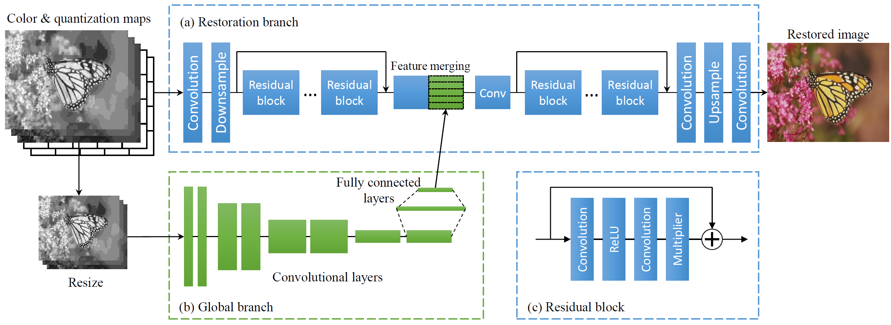

# Learning a Single Model With a Wide Range of Quality Factors for JPEG Image Artifacts Removal
This is the official implementation of the following paper:

Jianwei Li, Yongtao Wang, Haihua Xie, and Kai-Kuang Ma. "Learning a Single Model With a Wide Range of Quality Factors for JPEG Image Artifacts Removal". IEEE Transactions on Image Processing, Vol. 29, pp. 8842-8854, 2020. [[IEEE Xplore](https://ieeexplore.ieee.org/document/9186829)] [[arXiv](https://arxiv.org/abs/2009.06912)]

## Architecture

Incorporating the quantization tables into our network training. In JPEG-encoded color image, two quantization tables (QTs) are used, one for the luminance (the 8 × 8 QT or matrix as shown in (a)) and the other for the chrominance (i.e., the one on the back of (a)). The quantization maps (QMs) are constructed by tiling the QT through duplications as shown in (b), which has the same size as that of the compressed image as shown in (c). Combining the QMs in (b) and compressed image in (c), the feature maps, as illustrated in (d), is formed and will be used for training our network.


The network architecture of the proposed method. It contains the restoration branch (a) and the global branch (b). The restoration branch extracts local features and restores the compressed image. The global branch learns global features to improve the artifacts removal results. The global and local features are merged in the middle of the restoration branch. (c) is the structure of residual block in the network.

## Prerequisites
This project was developed and tested with PyTorch 0.4.1. Higher versions might work but are not guaranteed.

## Train
1. Set "--imgGTRoot" in the config file `params.py` to the path of your own training data. We use [DIV2K](https://data.vision.ee.ethz.ch/cvl/DIV2K/) dataset in our paper.
2. Run script to train models:

```bash
# QCN model, RGB image, input=64*64, quality factor range is [1,60]
python src/main.py --dataloader jpeg_qm --size 64 --batchSize 256 --quality [1,60] --colorMode RGB --net qmar --n_resblock 64 --loss L1 --cuda --threads 4 --gpus [0] --savedir the_dir_to_save_checkpoints

# QGCN model, grayscale image, input=64*64, quality factor range is [1,100]
python src/main.py --dataloader jpeg_qmg --size 64 --batchSize 256 --quality [1,100] --colorMode L --net qmarg --n_resblock 64 --loss L1 --cuda --threads 4 --gpus [0] --savedir the_dir_to_save_checkpoints
```
More training parameters please see the config file `params.py`.

## Test
1. Set the dict "dataPath" in files `eval_qm.py` and `eval_qmg.py` to the path of your own test data.
2. Run script to test models:

```bash
# Test QCN model on LIVE1 dataset under the quality factor 10
python src/eval_qm.py --model checkpoint/path_to_QCN_model.pth --GT --gtdata LIVE1 --quality 10 --cuda

# Test QGCN model on BSDS500 dataset under the quality factor 10
python src/eval_qmg.py --model checkpoint/path_to_QGCN_model.pth --GT --gtdata BSDS500 --quality 10 --cuda
```
More testing parameters please see the evaluation files.

## Results

A visual comparison of image artifacts removal results using different methods, with an emphasis to highlight that our method is able to handle global structure well. (a) the original image Sailing, (b) the JPEG-encoded image in 28.28 dB, with the quality factor of 10 imposed on the JPEG compression stage, (c) AR-CNN method [7] in 29.02 dB, (d) EDSR method [34] in 30.38 dB, (e) our QCN method in 30.62 dB, and (f) our QGCN method in 31.01 dB. Note that the annoying contours presented in the sky area in (b) almost completely disappear in (f). Also the overall color image quality presented in (f) is quite near to that of the ground truth in (a). This example demonstrates the effectiveness and advantage of introducing the proposed global network branch in our method.
<br/>
<br/>


A visual comparison of image artifacts removal results using different methods, with an emphasis to highlight that our method is able to handle local structure quite well. (a) the original image Cemetry, (b) the JPEG-encoded image in 23.79 dB, with the quality factor of 10 imposed on the JPEG compression stage, (c) AR-CNN method [7] in 24.50 dB, (d) EDSR method [34] in 25.45 dB, (e) our QCN method in 25.64 dB, and (f) our QGCN method in 25.94 dB. Note that our QGCN method effectively removes the ringing artifacts (around the characters and gate) and blocking artifacts (on the grass background).
<br/>
<br/>

<div align="center">

</div>
Performance comparisons of various methods based on the color images.
<br/>
<br/>

<div align="center">

</div>
Performance comparisons of various methods based on the grayscale images.
<br/>
<br/>

<div align="center">

</div>
A study of the generalization ability or robustness of our proposed method. The training of EDSR [34] model requires a specific quality factor determined in advance, and the performance will be dropped quickly for mismatched quality-factor cases. With wider range of quality factors being trained, a stable but lower performance is achieved as shown by EDSR10-50. On the other hand, our QGCN model not only yields a stable performance across all quality factors but gets the best performance.

## Citation
If you find this project helpful for your research, please cite the following paper:
```
@article{li-2020,
  author={Li, Jianwei and Wang, Yongtao and Xie, Haihua and Ma, Kai-Kuang},
  journal={IEEE Transactions on Image Processing}, 
  title={Learning a Single Model With a Wide Range of Quality Factors for JPEG Image Artifacts Removal}, 
  year={2020},
  volume={29},
  pages={8842-8854},
}
```

## License
IMPORTANT NOTICE: Although this software is licensed under MIT, our intention is to make it free for academic research purposes. If you are going to use it in a product, we suggest you [contact us](lijianwei@pku.edu.cn) regarding possible patent issues.
